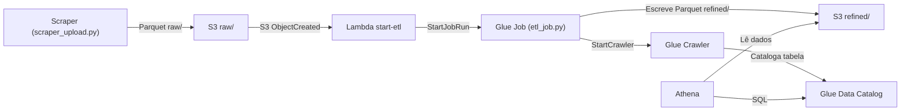

# m2-b3-market-data-pipeline

Projeto do Tech Challenge do módulo 2 como parte da Pós Tech em Machine Learning da FIAP.

## Indice

- [Visao geral](#visao-geral)
- [Arquitetura (fluxo)](#arquitetura-fluxo)
- [Estrutura do projeto](#estrutura-do-projeto)
- [Permissoes AWS (IAM)](#permissoes-aws-iam)
- [Checklist atendido](#checklist-atendido)
- [Video de Apresentacao](#video-de-apresentacao)
- [Como executar (AWS)](#como-executar-aws)
- [Queries do Athena (exemplos)](#queries-do-athena-exemplos)
- [Reset total (se precisar recomeçar)](#reset-total-se-precisar-recomecar)

## Visao geral
Pipeline AWS para coletar dados diarios da B3, gravar em S3 (parquet particionado),
disparar Lambda -> Glue Job -> Crawler e consultar via Athena.

## Arquitetura (fluxo)



## Estrutura do projeto

- `scraper/scraper_upload.py` — Scraper e upload para `s3://b3-datalake/raw/...`
- `etl/etl_job.py` — Glue Job (A/B/C: agregacao, renomeio, calculo temporal)
- `lambdas/start-etl/handler.py` — Lambda que inicia o Glue Job e o Crawler
- `scripts/bootstrap_aws.sh` — Provisiona bucket, Glue Job, Crawler e Lambda
- `scripts/reset_aws.sh` — Limpa recursos na AWS (reset total, com confirmacao)

Obs: o unico ETL valido do Glue e o `etl/etl_job.py`.

## Permissoes AWS (IAM)

Resumo das permissoes minimas para tudo funcionar. Ajuste `<account>`, `<region>`,
`<bucket>` e nomes conforme seu ambiente.

### 1) Role do Glue (GLUE_ROLE_ARN)

Anexe a policy gerenciada `service-role/AWSGlueServiceRole` e adicione acesso ao S3:

```
{
  "Version": "2012-10-17",
  "Statement": [
    {
      "Effect": "Allow",
      "Action": ["s3:ListBucket"],
      "Resource": "arn:aws:s3:::<bucket>"
    },
    {
      "Effect": "Allow",
      "Action": ["s3:GetObject", "s3:PutObject"],
      "Resource": [
        "arn:aws:s3:::<bucket>/raw/*",
        "arn:aws:s3:::<bucket>/refined/*",
        "arn:aws:s3:::<bucket>/jobs/*"
      ]
    }
  ]
}
```

### 2) Role da Lambda (LAMBDA_ROLE_ARN)

Anexe a policy gerenciada `AWSLambdaBasicExecutionRole` e permita iniciar Glue:

```
{
  "Version": "2012-10-17",
  "Statement": [
    {
      "Effect": "Allow",
      "Action": [
        "glue:StartJobRun",
        "glue:GetJobRun",
        "glue:GetJobRuns",
        "glue:StartCrawler"
      ],
      "Resource": [
        "arn:aws:glue:<region>:<account>:job/<glue_job_name>",
        "arn:aws:glue:<region>:<account>:crawler/<crawler_name>"
      ]
    }
  ]
}
```

### 3) Usuario/role que roda `scripts/bootstrap_aws.sh`

Precisa criar recursos e passar roles:

```
{
  "Version": "2012-10-17",
  "Statement": [
    {
      "Effect": "Allow",
      "Action": [
        "s3:CreateBucket",
        "s3:HeadBucket",
        "s3:ListBucket",
        "s3:PutBucketNotification",
        "s3:PutObject"
      ],
      "Resource": [
        "arn:aws:s3:::<bucket>",
        "arn:aws:s3:::<bucket>/*"
      ]
    },
    {
      "Effect": "Allow",
      "Action": [
        "glue:CreateDatabase",
        "glue:CreateJob",
        "glue:UpdateJob",
        "glue:CreateCrawler",
        "glue:UpdateCrawler"
      ],
      "Resource": "*"
    },
    {
      "Effect": "Allow",
      "Action": [
        "lambda:CreateFunction",
        "lambda:UpdateFunctionCode",
        "lambda:UpdateFunctionConfiguration",
        "lambda:GetFunction",
        "lambda:AddPermission"
      ],
      "Resource": "arn:aws:lambda:<region>:<account>:function:start-etl"
    },
    {
      "Effect": "Allow",
      "Action": "iam:PassRole",
      "Resource": [
        "arn:aws:iam::<account>:role/<glue-role>",
        "arn:aws:iam::<account>:role/<lambda-role>"
      ]
    }
  ]
}
```

### 4) Para consultar via Athena (opcional)

O usuario que roda queries no Athena precisa, no minimo:
- `athena:StartQueryExecution`, `athena:GetQueryExecution`, `athena:GetQueryResults`
- `glue:GetDatabase`, `glue:GetTables`, `glue:GetTable`
- `s3:GetObject` no `refined/` e no bucket de resultados do Athena

## Checklist atendido

- Scrap diario de dados da B3 (granularidade diaria)
- Dados brutos em parquet com particao diaria (`raw/ano=.../mes=.../dia=...`)
- Bucket aciona Lambda e Lambda chama Glue
- Glue Job com A/B/C (agregacao, renomeio, calculo temporal)
- Dados refinados em parquet em `refined/ativo=.../data=...`
- Catalogo e tabela no Glue Catalog via Crawler
- Consulta via Athena usando o Glue Catalog

## Video de Apresentacao

Link do Video de Apresentacao: <COLOQUE_O_LINK_AQUI>

Video demonstrando a arquitetura, funcionalidades e uso da API.

## Passo a passo (para funcionar)

1) Crie o bucket S3 e as roles IAM (Glue e Lambda) com as permissoes da secao acima.
2) Crie e ative um ambiente virtual Python:
   - `python -m venv .venv`
   - `source .venv/bin/activate`
3) Instale o AWS CLI (necessario para `scripts/bootstrap_aws.sh`):
   - https://docs.aws.amazon.com/cli/latest/userguide/getting-started-install.html
4) Instale dependencias do projeto:
   - `pip install -r requirements.txt`
   - Principais libs: `boto3` (AWS SDK), `pandas`, `yfinance`, `pyarrow`
4) O projeto inclui `pyrightconfig.json` apontando para `.venv` (caso use Pyright).
   Se precisar criar:
   ```
   {
     "venvPath": ".",
     "venv": ".venv"
   }
   ```
6) Preencha o `.env` na raiz (ou exporte as variaveis) com `AWS_REGION`, `BUCKET`,
   `GLUE_ROLE_ARN`, `LAMBDA_ROLE_ARN` e o `ATIVO` desejado.
7) Execute `./scripts/bootstrap_aws.sh` para criar Glue Job, Crawler e Lambda.
8) Rode `python scraper/scraper_upload.py` para baixar e enviar o parquet ao S3.
9) Confira a execucao do Glue Job e a tabela no Glue Catalog (Crawler).
10) Consulte os dados refinados no Athena.

## Como executar (AWS)

Opcional: crie um arquivo `.env` na raiz (os scripts carregam automaticamente):

```
AWS_REGION=us-east-1
BUCKET=b3-datalake
GLUE_JOB_NAME=b3-etl-job
GLUE_DB_NAME=default
CRAWLER_NAME=b3-refined-crawler
GLUE_ROLE_ARN=arn:aws:iam::<conta>:role/<glue-role>
LAMBDA_ROLE_ARN=arn:aws:iam::<conta>:role/<lambda-role>
# Defina um ativo (ex: VALE3) ou um ticker completo (ex: VALE3.SA)
ATIVO=VALE3
# TICKER=VALE3.SA
```

1) Configure credenciais e regiao da AWS:
   - `aws configure` ou variaveis `AWS_ACCESS_KEY_ID`, `AWS_SECRET_ACCESS_KEY`, `AWS_REGION`

2) Provisionar tudo (defina as roles):
   - `export GLUE_ROLE_ARN=arn:aws:iam::<conta>:role/<glue-role>`
   - `export LAMBDA_ROLE_ARN=arn:aws:iam::<conta>:role/<lambda-role>`
   - `./scripts/bootstrap_aws.sh`

3) Rodar o scraper (grava em `raw/` e dispara a Lambda via S3):
   - `python scraper/scraper_upload.py`

4) Verificar o Glue Job:
   - `aws glue get-job-runs --job-name b3-etl-job --max-results 1`

5) Verificar o refined no S3:
   - `aws s3 ls s3://b3-datalake/refined/ --recursive`

## Queries do Athena (exemplos)

```
SHOW DATABASES;
SHOW TABLES IN default;
DESCRIBE <nome_da_tabela>;
SELECT * FROM <nome_da_tabela> LIMIT 50;
```

## Reset total (se precisar recomeçar)

```
CONFIRM_AWS_RESET=YES ./scripts/reset_aws.sh
```
